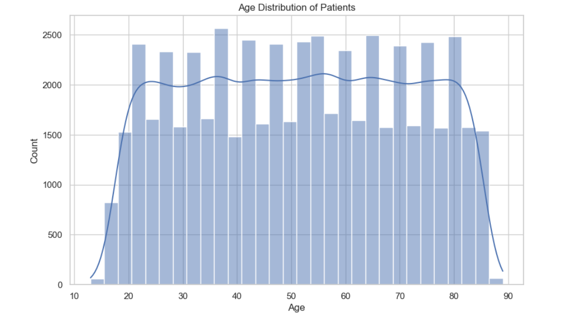
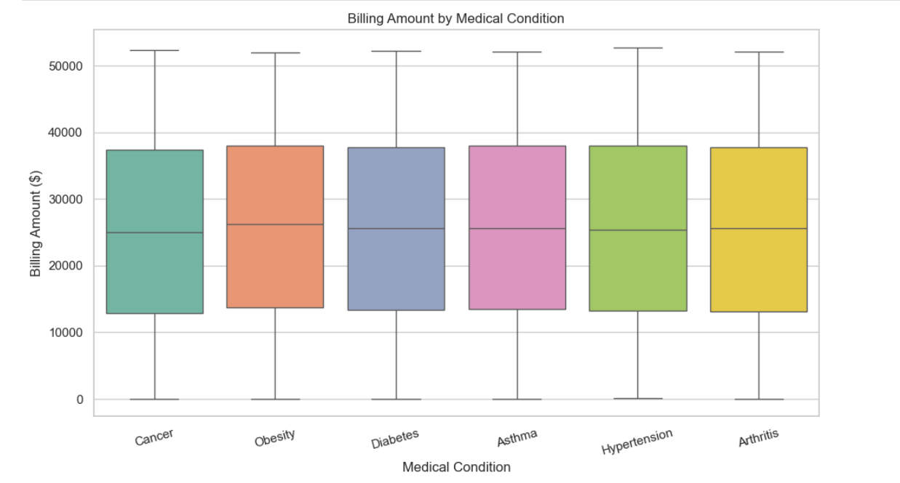
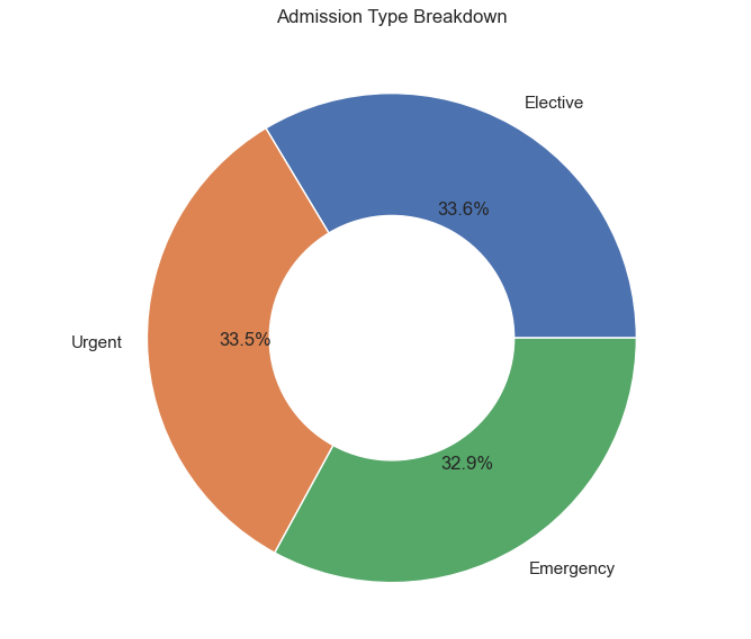

 # 🏥Healthcare Patient Analytics: End-to-End Data Analysis & Interactive Dashboard

    

---

# Healthcare Patient Data Analysis

## 📌 Project Overview

Healthcare institutions generate large amounts of patient data that can be analyzed to understand healthcare trends, patient demographics, and operational patterns.

This project performs **Exploratory Data Analysis (EDA)** on a healthcare dataset containing **54,000+ patient records** to identify patterns in **patient demographics, hospital admissions, medical conditions, insurance providers, and billing amounts**.

The objective is to use **data analysis and visualization techniques** to extract meaningful insights that can support **data-driven decision making in healthcare systems**.

---

## 🎯 Objectives

The main objectives of this project are:

* Analyze patient demographic patterns
* Identify the distribution of medical conditions
* Examine hospital admission types
* Explore patient billing patterns
* Understand hospital stay durations
* Derive insights from healthcare data

---

## 📊 Dataset Information

The dataset contains **54,860 patient records** with the following key attributes:

* Age
* Gender
* Blood Type
* Medical Condition
* Hospital
* Insurance Provider
* Admission Type
* Billing Amount
* Admission Date
* Discharge Date
* Length of Stay

---

## 🛠 Tools & Technologies

* **Python**
* **Pandas**
* **NumPy**
* **Matplotlib**
* **Seaborn**
* **Jupyter Notebook**
* **Excel**

---

## 🧹 Data Cleaning & Preparation

The following preprocessing steps were performed:

* Checked for missing values and inconsistencies
* Converted date columns to datetime format
* Created derived features such as **Length of Stay**
* Standardized column formats for analysis

---

## 📈 Exploratory Data Analysis

Exploratory data analysis was performed to understand patterns in:

* Patient age distribution
* Gender distribution
* Medical condition frequency
* Admission types
* Billing amount variation
* Hospital stay duration

Multiple visualizations were created to highlight trends and distributions within the dataset.

---

## 🔍 Key Insights

* The **average patient age is approximately 51 years**, indicating a middle-aged patient population.
* The **average hospital stay is around 15.5 days**, suggesting extended inpatient care.
* Patient **billing amounts vary widely**, with some exceeding **$50,000**.
* Medical conditions such as **Diabetes, Cancer, Hypertension, Asthma, Arthritis, and Obesity** appear across the dataset with similar frequency.
* Hospital admissions are distributed across **Emergency, Urgent, and Elective categories**.
* The dataset shows **balanced gender distribution** among patients.
* Insurance providers are relatively evenly distributed across patients.
* Variations in **length of stay indicate differences in treatment complexity**.

---

## 📊 Sample Visualizations

The analysis includes visualizations such as:

### Age Distribution


### Billing Amount Distribution


### Admission Type Distribution


### Monthly Admission Trend


---

## 📂 Project Structure

```
Healthcare-Patient-Analysis
│
├── Healthcare Analysis.ipynb
├── healthcare_cleaned_dataset.xlsx
└── README.md
```

---

## 🚀 Future Improvements

Possible future enhancements:

* Predict hospital **length of stay using machine learning**
* Analyze **seasonal patterns in hospital admissions**
* Build an **interactive healthcare dashboard**

---

## 📎 Author

**Preethi Chikkaboregowda**

This project is part of my **Data Analytics portfolio** showcasing skills in **data cleaning, exploratory data analysis, and data visualization using Python**.

